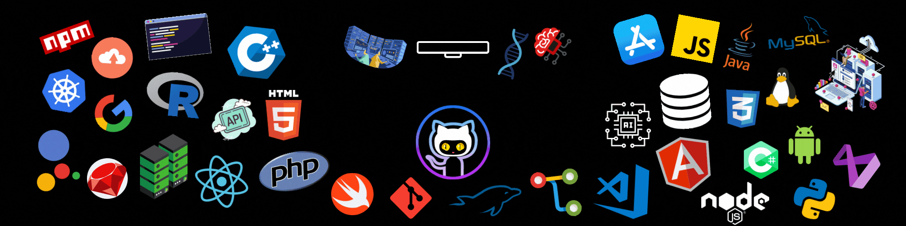

<h1>
  𝕎𝕖𝕝𝕔𝕠𝕞𝕖, 𝕞𝕪 𝕟𝕒𝕞𝕖 𝕚𝕤 ℙ𝕣𝕚𝕟𝕔𝕖 𝕂𝕦𝕞𝕒𝕣 𝕂𝕒𝕟𝕠𝕦𝕛𝕚𝕪𝕒. 

</h1>

# About Me  

I'm a **Jr. Software Engineer** at Cognizant Technology Solutions, Bangalore, with a passion for building scalable backend solutions and full-stack applications. I graduated from Graphic Era University with a B.Tech in Computer Science and Technology.

### 🚀 Professional Highlights
- Successfully executed **JDK17 migration** across legacy modules, achieving 100% development coverage
- Developed optimized **REST APIs** and microservices with **3ms response times** under high query loads
- Achieved **95% test coverage** through comprehensive unit and integration testing
- Optimized database queries, reducing execution times by **40%**

### 💼 Current Role
**Jr. Software Engineer - FSE** @ Cognizant Technology Solutions (Dec 2023 - Present)
- Working with Java, Spring Framework, Spring Boot, and Microservices Architecture
- Implementing CI/CD pipelines using Maven and Jenkins
- Ensuring code quality with Fortify and Black Duck
- Database optimization with MySQL

## 🛠️ Technical Skills

### Languages & Frameworks

### Databases & Tools

### Specializations
- **Backend Development**: Spring Boot, Microservices, REST APIs
- **DevOps**: Maven, Jenkins CI/CD, Fortify, Black Duck
- **Testing**: Unit Testing, Integration Testing
- **Problem Solving**: Data Structures & Algorithms (350+ problems solved)
- **AI/ML**: Prompt Engineering, Generative AI

## 🏗️ Featured Projects

### [Residential Community Hub](https://github.com/iprincekumark/residential-community-hub)
**Tech Stack**: Java | Spring Boot | Spring Data JPA | Microservices | React | MySQL | REST APIs

A full-stack web application designed to streamline community management with:
- Microservices architecture for scalability and reliability
- Visitor management system
- Centralized admin notifications
- Maintenance reporting tool
- Enhanced backend performance and user account management

### [Ecommerce Platform](https://github.com/iprincekumark/full-stack-ecommerce-project)
**Tech Stack**: React.js | Node.js | Express | MongoDB | Bootstrap

A secure e-commerce platform featuring:
- Intuitive admin interface for product and user management
- Robust authentication with bcrypt password hashing
- Optimized database schema for efficient data retrieval
- Responsive design with Bootstrap

## 🏆 Achievements & Certifications

- **11 Badges on LeetCode** - Problem-solving skills and algorithmic proficiency
- **350+ Problems Solved** - Max Contest Rating: 1930
- **Full Stack Java Developer Certification** - TalentSprint, Hyderabad (Aug 2023 - Nov 2023)

## 📊 GitHub Stats

## 📫 Connect With Me

---

  

